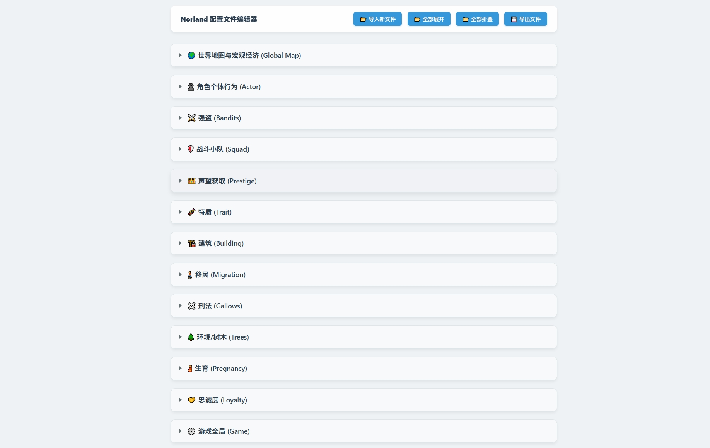

# 诺兰德 (Norland) 游戏参数编辑器



这是一个网页版的配置文件编辑器，专为修改《诺兰德 (Norland)》游戏的 `gameplay_variables.json` 文件而设计。它提供了直观的可视化界面和中文翻译，让您可以轻松自定义游戏难度和各种参数。

## ✨ 主要功能

*   **可视化编辑**：将复杂的 JSON 数据转换为易于理解的表单形式，层级结构清晰。
*   **中文翻译**：内置了核心参数的中文翻译（基于玩家社区经验），让您知道自己在改什么。
*   **导入功能**：支持导入游戏最新的 `gameplay_variables.json` 文件，即使游戏更新也能继续使用。
*   **导出功能**：修改完成后，一键导出标准的 JSON 文件。
*   **便捷操作**：支持一键“全部展开”或“全部折叠”，方便查阅。

## 🚀 如何使用

1.  **打开工具**：双击运行文件夹中的 `index.html` 文件（使用 Chrome、Edge 等现代浏览器打开）。
2.  **加载数据**：
    *   工具默认内置了一份基础配置数据。
    *   **推荐操作**：点击顶部的 **[📂 导入新文件]** 按钮，选择您游戏目录下的 `gameplay_variables.json` 文件，以确保基于您当前的游戏版本进行修改。
3.  **修改参数**：
    *   在输入框中修改数值。
    *   如果不确定某个参数的含义，可以参考中文标签（如果有）或保留原值。
4.  **导出文件**：
    *   修改完成后，点击顶部的 **[💾 导出文件]** 按钮。
    *   浏览器会下载一个新的 `gameplay_variables.json` 文件。
5.  **应用修改**：
    *   将下载的文件替换到游戏原本的配置目录中（建议先备份原文件）。

## 📁 项目结构

```
Norland-Editor/
├── index.html              # 🚀 程序入口
├── style.css               # 🎨 界面样式
├── script.js               # ⚡ 核心逻辑与翻译
├── gameplay_variables.txt  # 📖 参考词典 (中文注释)
└── README.md               # 📄 使用说明
```

## ⚠️ 注意事项

*   修改游戏参数可能会导致游戏平衡性崩坏或存档损坏，请务必在修改前**备份原始文件**。
*   如果游戏进行大版本更新，建议使用“导入”功能加载最新的配置文件，以避免参数缺失。

---
*Created for the Norland community. Open Source & Free.*
